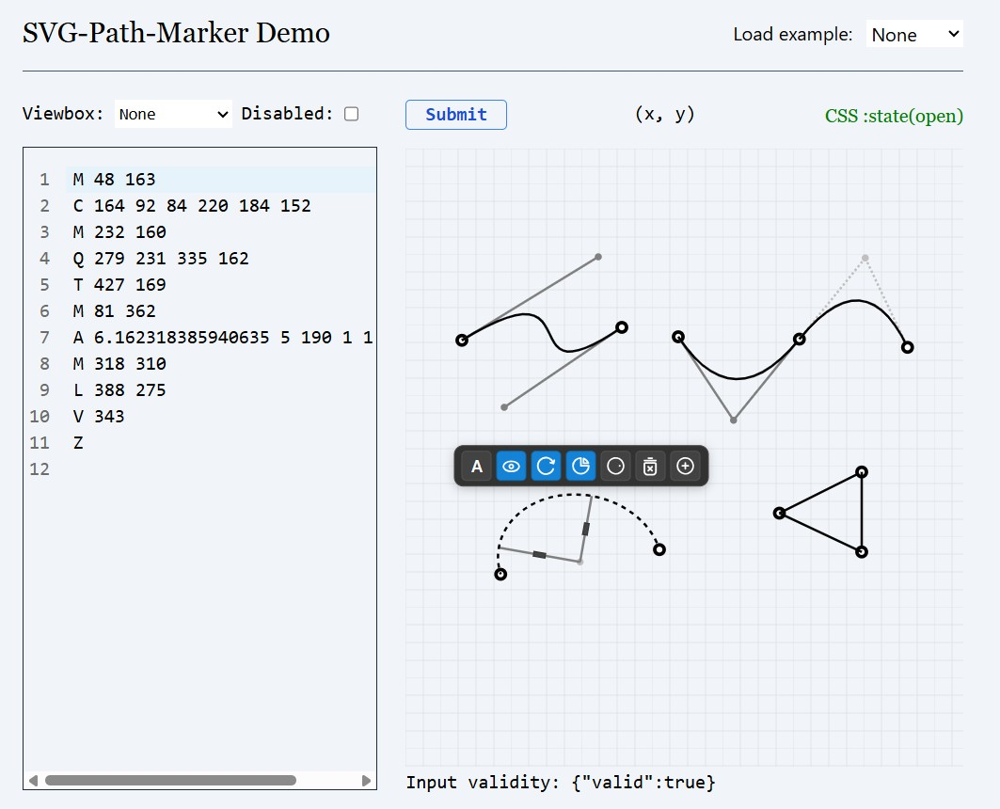

# SVG Editor

A simple web-based SVG editor for creating and editing scalable vector graphics.

> [!WARNING]
> This package is still in the experimental phase. You can expect new functionalities, but with this comes the possibility of more frequent errors

> [!CAUTION]
> Package is not yet available on npm registry

[](https://www.npmjs.com/package/svg-path-marker)




## Demo

See https://akcyp.github.io/svg-path-marker/

## Features

- Draw and edit SVG shapes
- Cross framework support thanks to Web Component implementation
- Keyboard support
- Undo/redo actions

## Installation

```
# with npm
npm i svg-path-marker
# with yarn
yarn add svg-path-marker
# with pnpm
pnpm add svg-path-marker
```

## Usage

```ts
// Load with JS / TS:
import 'svg-path-marker';
import type { SVGPathMarker } from 'svg-path-marker';
```

```html
<!-- Load with html script tag: -->
<script type="module" src="./node_modules/svg-path-marker"></script>

<!-- Usage: -->
<svg-path-marker d="M 0,0" viewBox="0 0 500 500">
  <!-- Any content, for example: -->
  
</svg-path-marker>
```

```css
svg-path-marker:disabled {
  /* Custom disabled styles */
}
svg-path-marker:state(open) {
  /* Custom open styles (when at least one path is not closed) */
}
svg-path-marker:state(closed) {
  /* Custom closed state (when all paths are closed) */
}
svg-path-marker:state(drag) {
  /* While moving points */
}
```

Props:

```ts
export interface SVGPathMarkerProps {
  /**
   * Required path[d] prop, for reference see:
   * - https://developer.mozilla.org/en-US/docs/Web/SVG/Reference/Attribute/d
   * - https://www.w3.org/TR/1999/WD-SVG-19990412/paths.html
   */
  d: string;
  /**
   * When present, makes the editor not mutable
   */
  disabled?: boolean;
  /**
   * The viewBox attribute defines the position and dimension, in user space, of an SVG editor viewport.
   */
  viewBox?: string;
}
```
